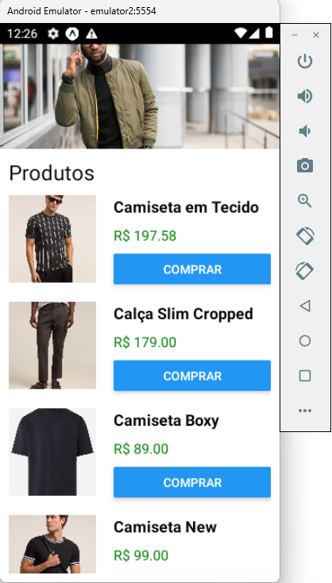

# Loja Básica com React Native

Este é um projeto de exemplo que demonstra a construção de uma loja básica utilizando React Native. O projeto utiliza componentes, listas, hooks, props e botões para criar uma interface de usuário interativa e funcional.

## Descrição

Neste projeto, desenvolvemos um aplicativo React Native que simula uma loja. Utilizamos diversos recursos do React Native para construir a aplicação, incluindo componentes reutilizáveis, listas para exibição de produtos, e hooks para gerenciamento de estado. O objetivo é mostrar como criar uma aplicação móvel básica e funcional com React Native.

## Tecnologias

- **React Native**: Framework para construir aplicativos móveis usando JavaScript e React.
- **FlatList**: Componente utilizado para exibir uma lista de dados de forma eficiente.
- **Hooks**: Funções como `useState` para gerenciamento de estado e efeitos colaterais.
- **Props**: Propriedades passadas para componentes para personalização e comunicação entre eles.

## Funcionalidades

- Exibe uma lista de produtos usando o componente `FlatList`.
- Utiliza hooks para gerenciar o estado dos produtos e outras interações.
- Implementa componentes reutilizáveis para diferentes partes da interface, como botões e cartões de produtos.
- Permite a navegação entre diferentes telas da aplicação.

## Instalação

Para começar a usar este projeto, siga as instruções abaixo:

1. **Clone o repositório**:
   ```bash
   git clone https://github.com/jotafin/loja-basica.git


2. **Navegue até o diretório do projeto**:

   ```bash
     cd loja-basica


3. **Instale as dependências**:

   ```bash
     npm install
     # ou
     yarn install


4. **Execute o projeto**:

   ```bash
     npx expo start

Isso abrirá o Expo Developer Tools no navegador. Você pode escanear o QR code com o aplicativo Expo Go no seu dispositivo móvel para visualizar o aplicativo, ou utilizar um emulador Android/iOS.


## Capturas de Tela
   <p align="center">  </p>

## Licença
Lançado em 2024.

Este projeto está sob a licença MIT license.


